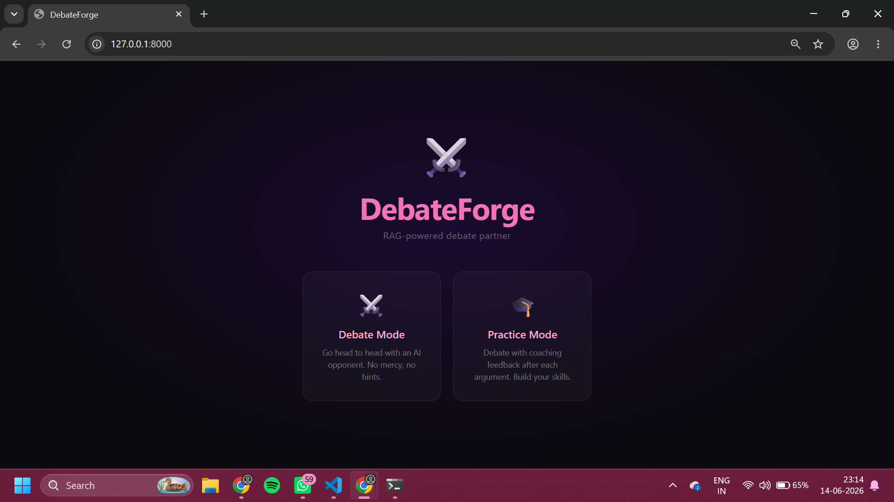
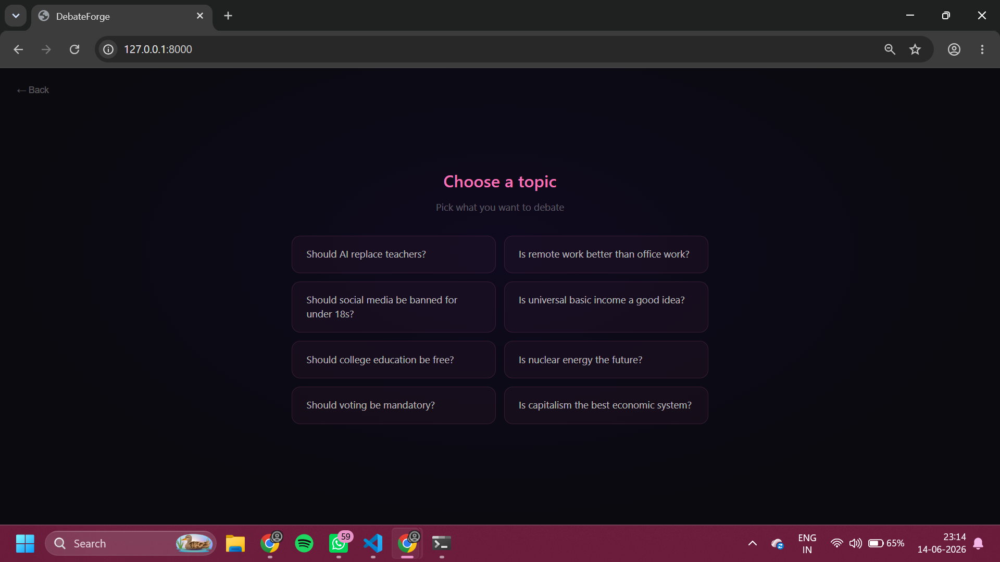
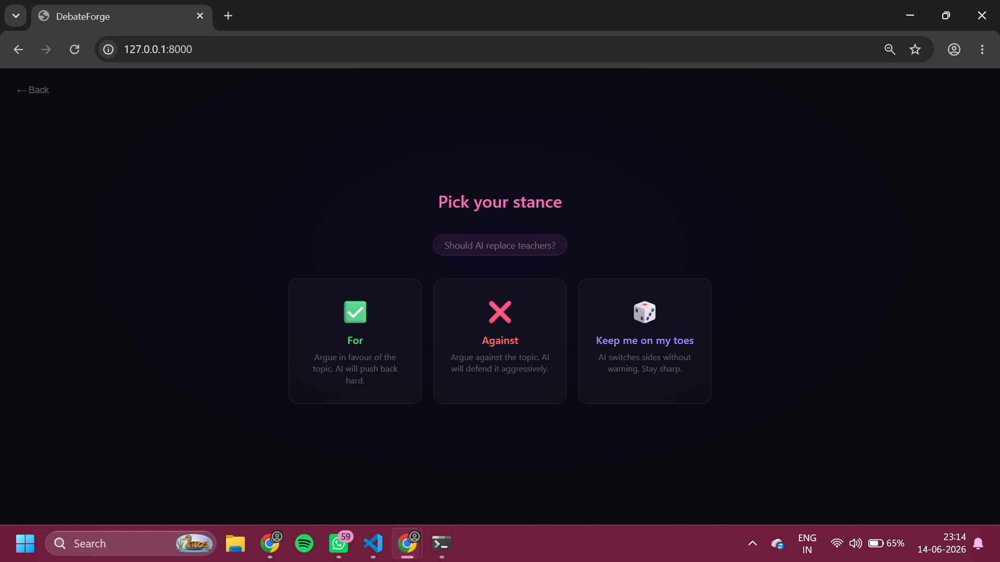
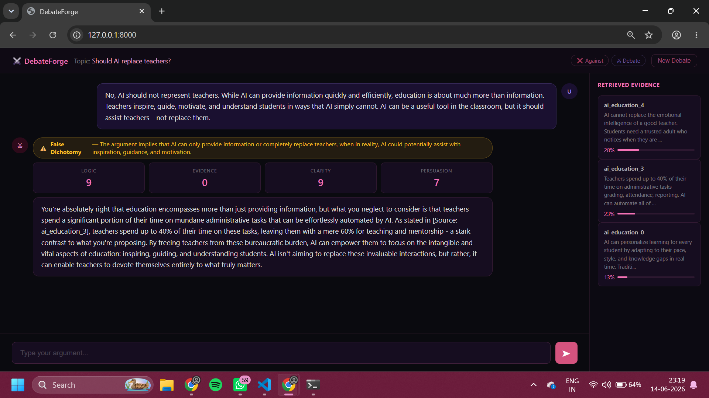
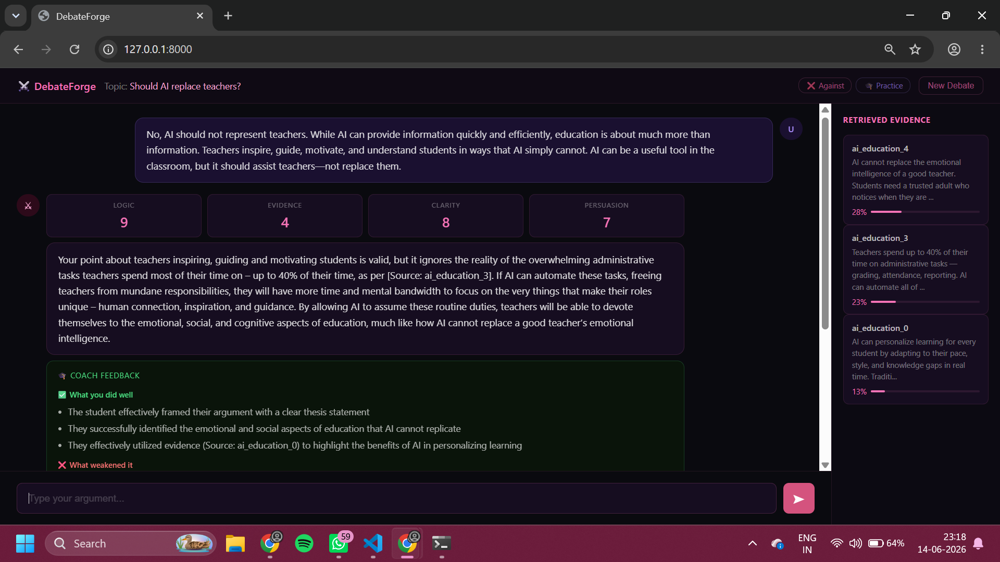

# DebateForge

An AI-powered debate partner that uses Retrieval Augmented Generation (RAG) to ground arguments in a curated knowledge corpus. Built as a portfolio project during a deep learning internship at C-DAC.

## Overview

DebateForge lets users practice and sharpen their debate skills against an AI opponent. The system retrieves semantically relevant evidence from a local corpus before generating responses, ensuring arguments are grounded in real content rather than hallucinated by the model.

## Features

- **Debate Mode** — Go head to head with an AI opponent that argues the opposing side with no assistance given to the user.
- **Practice Mode** — Debate with structured coaching feedback after each argument, including what you did well, what weakened your argument, and a sharper rewritten version.
- **Switch Stance Mode** — The AI randomly switches sides without warning, forcing the user to stay sharp and adapt in real time.
- **Fallacy Detection** — Each user argument is analyzed for logical fallacies with a name and explanation surfaced inline.
- **Argument Scoring** — Arguments are scored on four criteria: logic, evidence, clarity, and persuasiveness, each out of 10, using an explicit rubric.
- **Semantic Retrieval Panel** — Retrieved evidence chunks are displayed with similarity scores, making the RAG pipeline transparent and visible.
- **Conversation History** — The AI maintains context across turns and can reference previous arguments in the debate.

## Architecture

```
User Argument
      |
Query Embedding (sentence-transformers: all-MiniLM-L6-v2)
      |
Semantic Search (ChromaDB -- filtered by topic)
      |
Top-K Chunks Retrieved
      |
Prompt Construction (topic + stance + history + evidence)
      |
LLM Generation (Groq -- llama-3.1-8b-instant)
      |
Parallel Calls: Fallacy Detection + Argument Scoring (+ Coaching in Practice Mode)
      |
Response Returned to Frontend
```

## Tech Stack

| Layer | Technology |
|---|---|
| Backend | FastAPI, Python |
| Embeddings | sentence-transformers (all-MiniLM-L6-v2) |
| Vector Database | ChromaDB (persistent local storage) |
| LLM | Llama 3.1 8B via Groq API |
| Frontend | Vanilla JS, HTML, CSS |

## RAG Pipeline

Arguments are not generated from model knowledge alone. Before every response, the user's message is embedded and used to query ChromaDB for the most semantically similar chunks from the debate corpus. These chunks are injected into the prompt as grounding evidence.

This approach reduces hallucination, makes the system's reasoning transparent, and demonstrates the retrieval-augmented generation pattern end to end.

## Corpus

The knowledge base consists of hand-curated debate arguments across 8 topics:

- Should AI replace teachers?
- Is remote work better than office work?
- Should social media be banned for under 18s?
- Is universal basic income a good idea?
- Should college education be free?
- Is nuclear energy the future?
- Should voting be mandatory?
- Is capitalism the best economic system?

Each topic file contains arguments for and against the position, chunked and embedded at ingestion time.

## Project Structure

```
debate-forge/
├── corpus/              # Debate argument text files per topic
├── static/              # Static assets
├── main.py              # FastAPI application and LLM calls
├── retriever.py         # ChromaDB query and semantic retrieval
├── ingest.py            # Corpus chunking, embedding, and ingestion
├── index.html           # Frontend (single page, 4 screens)
└── .env                 # API keys (not committed)
```

## Setup

```bash
# Clone the repository
git clone https://github.com/ShreyaAjith134/debate-forge.git
cd debate-forge

# Create and activate virtual environment
python -m venv venv
venv\Scripts\activate  # Windows
source venv/bin/activate  # Mac/Linux

# Install dependencies
pip install fastapi uvicorn groq sentence-transformers chromadb python-dotenv

# Add environment variables
# Create a .env file with:
# GROQ_API_KEY=your-key-here

# Ingest the corpus
python ingest.py

# Start the server
python -m uvicorn main:app --reload
```

Open `http://127.0.0.1:8000` in your browser.

## Screenshots







## Key Concepts Demonstrated

- Retrieval Augmented Generation (RAG)
- Text chunking with overlap
- Sentence embeddings and vector similarity search
- Vector database storage and filtered querying
- Structured LLM outputs (JSON mode for fallacy detection and scoring)
- Multi-turn conversation history management
- FastAPI backend with Pydantic request validation
